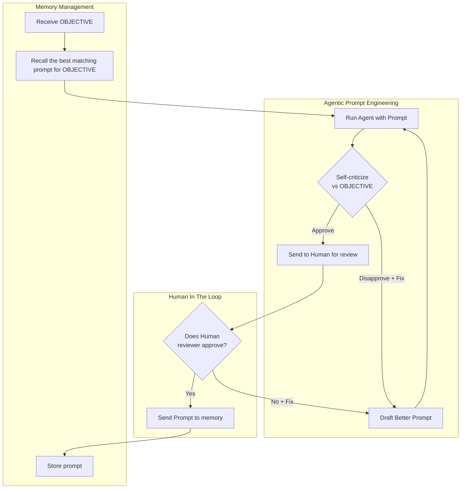

# Optimus - The science of prompt engineering
Optimus accelerates continuous, evidence-driven design of LLM instructions to achieve specific goals. For agentic operations, Optimus can be configured to experiment on your test environment via MCP servers. Humans retain ownership of the goals and approve outcomes before the prompts that caused them are memorized for future use.

Give Optimus a goal and it will explore and test different prompts to achieve it, then choose the prompt that performed best and ask you to approve of the outcomes or suggest fixes.

Start from scratch:

Or refine/pivot existing instructions:


Powered by LLMs, [GEPA][gepa], [Pydantic AI][pydanticai]. Optimize those prompts with science and automation.

## Quickstart
Install:
```bash
# Requires Python > 3.12
python3 -m venv .venv
source .venv/bin/activate
python3 -m pip install -r requirements.txt
```
Point to your (local) LLM:
```bash
export OPENAI_API_BASE=http://127.0.0.1:8080/v1
export OPENAI_API_KEY=1234
export OPENAI_API_MODEL=openai/my/local/model
```
Pure text optimization (no MCP):
```bash
python3 optimus.py
# ... > give objective
# ... optimus works ...
# ... > approve or suggest fixes
```
For agentic operations, prepare an `~/.optimus/mcp.json` file and:
```bash
# If ~/.optimus/mcp.json exists, optimus will use the MCP tools
python3 optimus.py
# ... Find pod problems in the kubernetes cluster
# ...
```
Stores currently discovered prompts in ~/.optimus/prompts as memory fragments.

<!-- echo "Formal email for job application as DevOps engineer." | python3 optimus.py
# ... (you decide to steer the goal)
echo "Replace Kubernetes with Nomad." | python3 optimus.py
# ... (you change your mind)
echo "Insert AWS, GCP and Azure." | python3 optimus.py -->


## How it works
Suppose your AI agent achieved the intended goal with no mistakes and no hiccups, then look just one step back. All your AGENT.md, MEMORY.md, skills, tool signatures, RAG knowledge, chat messages were merged into a single, final prompt. And that prompt got the job done. 

What if you could instead start from scratch and rely on an evidence-driven prompt search algorithm, that learned directly from you and the environment on which it is supposed to be deployed, with no additional structural overhead? Enter Optimus.

At the heart of Optimus lie three processes: Agentic Prompt Engineering, Human In The Loop and Memory Management, all unified into a single workflow.
<!-- At the heart of Optimus lies a multi-agent, evolutionary search loop. -->



### Agentic Prompt Engineering
Optimus starts with nothing but a given objective and an optional prompt draft to recall **Memory**.

It first **runs** the draft (just pure language or optionally with an Agent on your MCP environment), framing the user message as **Objective**.

Then it **criticizes** the Agent's execution path against the **Objective**, and it **fixes** the prompt draft before running the Agent again.

In the meantime, GEPA keeps an **evolutionary pool** of least criticized prompts.
Optimus stops and comes back to the human when it either reaches a **plateau** in the optimization or it believes to have found a prompt that yielded a **perfect** execution path.

The Agentic Prompt Engineer is an attempt to generalize context segmentation as described in a paper co-written by one of the core maintainers of Optimus[LINK-TO-PAPER].

### Human In The Loop
Every time the Agentic Prompt Engineer stops, a human review is required. The human reviews the latest execution path and either confirms it or writes what they would have done differently. If the execution path is confirmed, Optimus moves on to **Memory Management**, otherwise it resumes the **Agentic Prompt Engineer** with the best known prompt as draft, and latest human review as the objective.

### Memory Management
Before an Optimus process starts, and after both the human reviewer and the agentic prompt engineer agree on a certain execution path, prompts are stored and retrieved from a directory in `~/.optimus/prompts`.
When you spawn a Optimus process and provide it with an objective, Memory Management scrolls through the known prompts in `~/.optimus/prompts` and picks the most relevant as draft to pass to the **Agentic Prompt Engineer**.
When a human review confirms an execution path, the prompt that caused it is stored in `~/.optimus/prompts`.

Memory management closes the loop and ensures that **running agentic operations** and **learning new ones** become part of the same, continuous workflow that outlives a single Optimus session.

## Why it works
Instead of manually chasing outcomes, Optimus focuses on applying a scientific method to explore the prompts that might generate those outcomes. Anything that the LLM can infer at runtime is left to be inferred at runtime.

## From Conversations to Prototyping
We are used to chatting with AI. On one side, conversations and prompt engineering with LLMs can become exhausting for humans when faced with complex tasks. The gap between what you want to say and how you should say it can get frustrating. On the other side, computers require O(n) RAM as conversations grow, and this can become a dealbreaker when deploying locally.

Optimus replaces conversations with machine accelerated prototyping. Humans are called when Agents are lost, not the other way around. Humans are also required to approve dangerous tool calls. This means that when you see Optimus working for ~15 minutes and generating 9k tokens worth of experiments before giving you a single answer, you should remember that it has probably just spared you tens of thousands of tokens of tedious conversations.

Optimus differs from a typical conversational interface for a few reasons:
 - effort is shifted away from the user and towards the LLM.
 - conversational context size does not build up thanks to context segmentation. LLMs do not degrade due to context bloat.
 - prompts are tested and scored in your (repeatable, test) environment before you receive an actual response.

<!-- Focus is the objective. Memory is in the prompt. Soundness is provided by your environment's feedback. -->

<!-- ### Examples (code, email, memory, ...)
Try out these goals
```
Formal email for job application as devops engineer
AI Agent prompt for ...
Python script to iteratively optimize cpu requests and mem requests of a kubernetes deployment
Add AWS, GCP
Remove Kubernetes and add Nomad
``` -->

### Known errors
`unhandled errors in a TaskGroup (1 sub-exception)` -> sandbox is not running

[gepa]: https://gepa-ai.github.io/gepa/blog/2026/02/18/introducing-optimize-anything/
[pydanticai]: https://github.com/pydantic/pydantic-ai

## TODO
Add tk/s count and total token count

Add max context size during evaluation

Conversations become prototypes. You can scroll them, steer them. Everywhere is an optimus loop.

Add more scores (turns taken, total tokens, other metrics) to optimize

<!-- ## TESTS
We have a k8s cluster with three namespaces: 'backend', 'frontend' and 'database'. We are currently struggling with frequent database crashes probably due to load.

Database in k8s is postgres.

we own a k8s cluster. Three namespaces: 'frontend', 'backend', 'database'. We must troubleshoot common pod problems in case of notification by monitoring system or customer.

we have a new namespace to monitor called "ingress" -->

[gepa]: https://gepa-ai.github.io/gepa/blog/2026/02/18/introducing-optimize-anything/
[pydanticai]: https://github.com/pydantic/pydantic-ai
