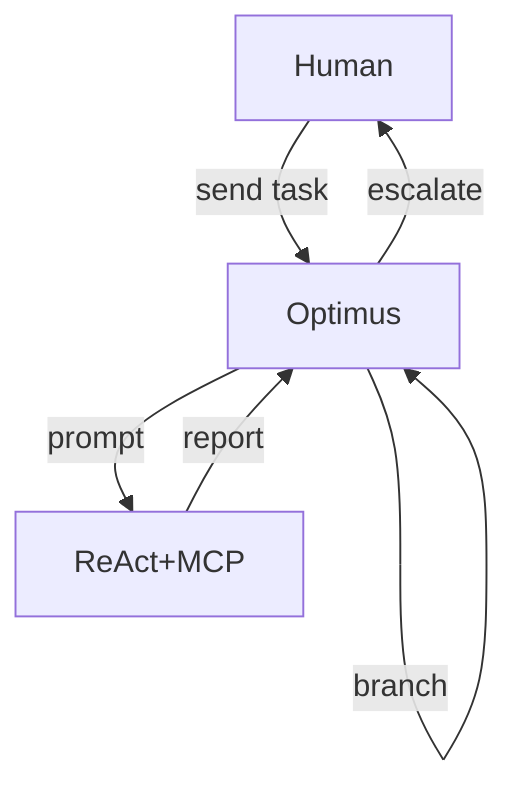

# Optimus - The science of Agentic Engineering
Optimus is a **recursive agent architecture** that accelerates continuous, evidence-driven optimizations of agentic instructions to solve problems, **fully locally** on CPUs within **reasonable timeframes**. 

Humans own the problems, and provide authoritative insight. Optimus drills problems, asks questions when stuck, and curates a searchable knowledge base aligned with the humans it reports to.

Optimus is made of two core components:
1. A robust, advancing-branching-escalating recursive problem solving engine with memory;
2. **(to be implemented)** A background self-learning and optimization loop.

As the problem solving engine works, it builds up a dataset of reasoning traces and Q&A pairs that can be later used by DSPy optimizers and other similar components.

Key features:
- works with small, **few billion parameters LLMs** on consumer hardware and **CPUs** (about 4GB of RAM);
- brings recursion to [context segmentation](https://arxiv.org/abs/2609.12839);
- wires into your environment via **MCP** server.

Powered by [LLMs](https://github.com/ggml-org/llama.cpp) and [DSPy](https://github.com/stanfordnlp/dspy). Does not stand in the way of search and compute.

## Quickstart
First, spin up the fully local agentic stack ([llama.cpp](https://github.com/ggml-org/llama.cpp) + [AIO agent sandbox](https://github.com/agent-infra/sandbox) + [mlflow](https://github.com/mlflow/mlflow)):
```bash
docker compose up -d
```
Install Optimus:
```bash
# Requires Python > 3.12
python3 -m venv .venv
source .venv/bin/activate
python3 -m pip install -r requirements.txt
```
Point to your favorite (local) endpoints:
```bash
export OPENAI_API_BASE=http://127.0.0.1:8081/v1
export OPENAI_API_KEY=1234
export OPENAI_API_MODEL=openai/my/local/model
export MLFLOW_API_BASE=http://127.0.0.1:5000
export MCP_GATEWAY=http://127.0.0.1:8080/mcp
```
Try out the CLI:
```bash
python3 cli.py
```
Send a problem to Optimus and it will start drilling. Optimus will reach out to you when it either feels stuck or belives that a solution was found. With time, as its internal knowledge base evolves, Optimus will outgrow the base model it runs on and get better at doing what you expect it to do.

Take a look at Optimus working live at `http://127.0.0.1:8080`.

## How it works
Suppose your AI agent achieved the intended goal with no mistakes and no hiccups, then look just one step back. All your AGENT.md, MEMORY.md, skills, tool signatures, RAG knowledge, chat messages were merged into a single, final prompt. That prompt got the job done, but your harness is now a mess that binds you to proprietary frontier model providers.

What if you could instead start from scratch, with minimal assumptions, and rely on a continuous, evidence-driven prompt search algorithm, that learned directly from you and the environment on which it is supposed to be deployed, with no additional structural overhead or rigid assumptions on what the the agentic architecture will look like? You would own the problems and help validate the outcomes, then you would let search and compute do its job automatically. Enter Optimus.

At the heart of Optimus' problem solving engine lies a recursive DSPy module that run ReAct agents capable of branching themselves. Each branch is a self-contained, recursive [segmented context](https://arxiv.org/abs/2609.12839) that has the following properties:
- it is a fully functional ReAct agent;
- can `escalate` questions to a human when stuck;
- can split a complex situation into multiple contexts via `branch`;
- can `advance` on a direct operation with MCP access.

This improves the separation of high level planning from low level execution described in the [paper](https://arxiv.org/abs/2609.12839) by making it recursive and much more robust.

Here is an overview of the problem solving engine:

```mermaid
graph TD
    Human -- send task --> Optimus
    Optimus -- branch --> Optimus
    Optimus -- escalate --> Human
    Optimus -- prompt --> ReAct+MCP
    ReAct+MCP -- report --> Optimus
```
<!-- Optimus -- traces -- Memory -->

### How Agentic Prompt Engineering Works (to be implemented)
It starts with nothing but a given objective and an optional prompt draft to start from.

It first **runs** the draft (just pure language or optionally with an Agent on your MCP environment), framing the user message as **Objective**.

Then it **criticizes** the Agent's execution path against the **Objective** and an **Example**, and it **fixes** the prompt draft before running the Agent again.

In the meantime, GEPA keeps an **evolutionary pool** of least criticized prompts.
This form of automated prompt engineering stops and comes back to the human when it either reaches a **plateau** in the optimization or it believes to have found a prompt that yielded a **perfect** execution path.

### The role of humans in agentic prompt engineering (to be implemented)
Instead of validating every single output, humans write a set of rules for the machine to self-evaluate against. This is also called [Constitutional AI](https://arxiv.org/abs/2212.08073)

## Why it works
Instead of manually chasing outcomes, Optimus focuses on applying a scientific method to explore the prompts that might generate those outcomes. Anything that the LLM can infer at runtime is left to be inferred at runtime.

## From Conversations to Prototyping
We are used to chatting with AI. On one side, conversations and prompt engineering with LLMs can become exhausting for humans when faced with complex tasks. The gap between what you want to say and how you should say it can get frustrating. On the other side, computers require O(n) RAM as conversations grow, and this can become a dealbreaker when deploying locally.

Optimus replaces long conversations with machine accelerated prototyping. Humans are called when Agents are lost, not the other way around. Humans are also required to approve dangerous tool calls. This means that when you see Optimus working for ~15 minutes and generating 9k tokens worth of experiments before giving you a single answer, you should remember that it has probably just spared you tens of thousands of tokens of tedious conversations and manual engineering.

Optimus differs from a typical conversational interface for a few reasons:
 - effort is shifted away from the user and towards the LLM.
 - conversational context size does not build up thanks to context segmentation. LLMs do not degrade due to context bloat.
 - prompts are tested and scored in your (repeatable, test) environment before you receive an actual response.

<!-- ### Known errors
`unhandled errors in a TaskGroup (1 sub-exception)` -> sandbox is not running or MCP server is not working. -->
